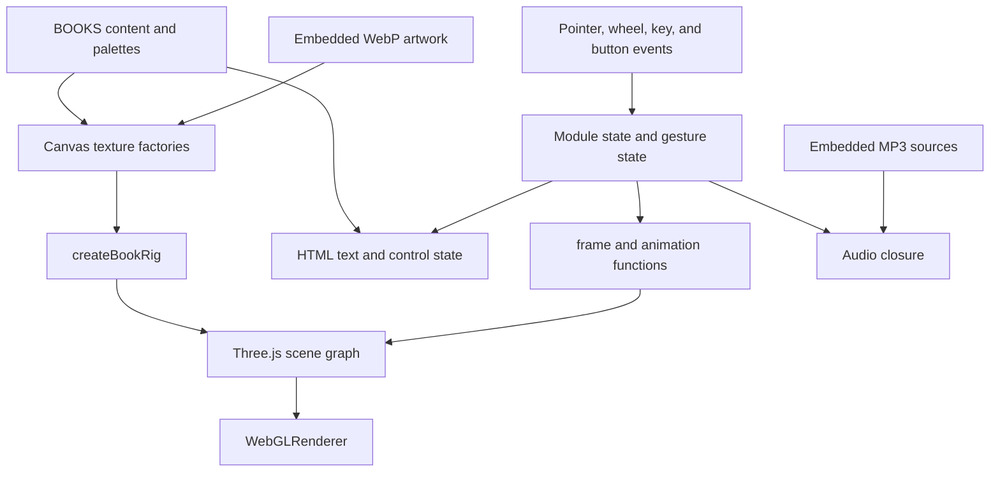
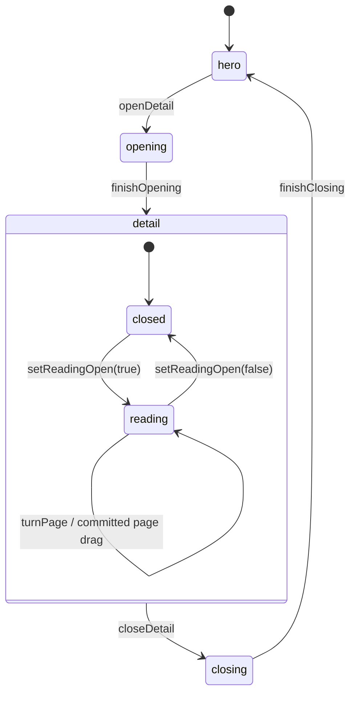

# Complete Shelf: Repository Architecture and Runtime Guide

This document explains how [`MengTo/complete-shelf`](https://github.com/MengTo/complete-shelf) works, from its files and data structures to its geometry, event handlers, animation loop, and resource lifecycle.

**Source snapshot:** [`b0b532411a9ba9f56ebcebdffe06747be0dcd84d`](https://github.com/MengTo/complete-shelf/tree/b0b532411a9ba9f56ebcebdffe06747be0dcd84d), inspected September 22, 2026. The commit is titled “Add Pika-generated audio feedback.” All source links below are pinned to this revision.

**Scope:** This documents the linked Complete Shelf repository, not the personal website repository containing this Markdown file. The explanations come from static inspection of the tracked source. Call stacks are reconstructed execution paths, not captured browser traces. Browser rendering, performance, and accessibility have not been independently tested for this document. TypeScript-style shapes below are explanatory models; the application itself is JavaScript.

## Contents

1. [What the application is](#1-what-the-application-is)
2. [File tree and source map](#2-file-tree-and-source-map)
3. [Architecture and subsystem boundaries](#3-architecture-and-subsystem-boundaries)
4. [HTML components and CSS hierarchy](#4-html-components-and-css-hierarchy)
5. [Data shapes and state ownership](#5-data-shapes-and-state-ownership)
6. [Scene hierarchy and book construction](#6-scene-hierarchy-and-book-construction)
7. [Texture generation and materials](#7-texture-generation-and-materials)
8. [Startup and initialization](#8-startup-and-initialization)
9. [State machine and shelf navigation](#9-state-machine-and-shelf-navigation)
10. [Shelf-to-detail transitions](#10-shelf-to-detail-transitions)
11. [Reading, gestures, and page deformation](#11-reading-gestures-and-page-deformation)
12. [Call stacks and frame execution](#12-call-stacks-and-frame-execution)
13. [Responsive composition and theming](#13-responsive-composition-and-theming)
14. [Audio subsystem](#14-audio-subsystem)
15. [Accessibility, fallback, and lifecycle](#15-accessibility-fallback-and-lifecycle)
16. [Main function reference](#16-main-function-reference)
17. [Running and extending the repository](#17-running-and-extending-the-repository)
18. [Implementation caveats](#18-implementation-caveats)

## 1. What the application is

Complete Shelf is an interactive 3D catalog of seven imagined hardcovers. Its browser-facing identity is **Working Volumes — Seven Tools for Making**. A visitor moves along a looping shelf, selects a book, inspects it with camera controls, opens its front cover, and turns a small set of sample pages.

The entire production application is in `index.html`: HTML, CSS, JavaScript, embedded WebP artwork, and embedded MP3 audio. There is no application framework, package manifest, bundler, server application, database, route hierarchy, or build pipeline in the tracked repository. The page uses ES modules and an import map to load **Three.js 0.165.0** and four addons from jsDelivr. Inter is loaded through Google Fonts. The embedded media does not make the application fully offline-independent because those external module and font requests remain. [Source: imports and entry module][imports]

| Dependency / browser facility | Purpose |
| --- | --- |
| `three` | Scene graph, geometry, materials, camera, raycasting, and WebGL rendering |
| `OrbitControls` | Camera orbit, pan, and zoom in detail mode |
| `RoomEnvironment` + `PMREMGenerator` | Prefiltered environment texture for material lighting |
| `RoundedBoxGeometry` | Hardcover boards, page block, and spine construction |
| `RectAreaLightUniformsLib` | Initialization needed by rectangular area lights |
| Canvas 2D + `CanvasTexture` | Runtime artwork, paper, cloth, foil masks, and surface maps |
| `HTMLAudioElement` | Embedded soundtrack and interaction cues |
| Pointer Events + `Raycaster` | Book picking, click detection, cover dragging, and page dragging |
| `requestAnimationFrame` | Animation scheduling and drawing |
| `localStorage` | Optional persistence of mute and volume only |

The creative-tool names are editorial subjects of the books. Selecting “Figma” or “Codex” does not call those products. The browser contains no runtime AI-generation or MCP integration.

## 2. File tree and source map

### Complete tracked file tree

```text
complete-shelf/
├── .gitignore
├── PROMPT.md
├── README.md
├── assets/
│   └── complete-shelf-preview.jpg
└── index.html
```

This is the complete tracked tree at the inspected commit. `.git/` is local Git metadata and is excluded.

| File | Responsibility |
| --- | --- |
| [`index.html`][source] | Complete runnable experience; 6,307 lines and 2,233,796 bytes in this snapshot |
| [`README.md`][readme] | Overview, screenshot, local serving instructions, and project context |
| [`PROMPT.md`][prompt] | Recreation/remix brief and suggested verification steps; it is not executed |
| [`assets/complete-shelf-preview.jpg`][preview] | README preview image, 64,792 bytes; not a runtime book texture |
| [`.gitignore`][ignore] | Ignores `.DS_Store` |

### Logical regions within `index.html`

Because there are no component files, line ranges are the practical navigation system.

| Lines | Region | What to look for |
| --- | --- | --- |
| 1–17 | Document metadata and font link | Title, description, theme color, Inter |
| 18–1713 | Inline stylesheet | Base styling, later overrides, responsive rules, audio controls |
| 1714–1721 | Import map | Pinned Three.js module URLs |
| 1723–1879 | HTML UI | Canvas, catalog controls, detail dialog, fallback, loading layer |
| 1881–1886 | Module imports | Three.js and its four addons |
| 1888–2120 | `BOOKS` | Seven content records with palettes, dimensions, and chapters |
| 2122–2155 | Embedded media and images | Large data URLs, atlas crops, image decode state |
| 2157–2206 | DOM references and math helpers | Cached controls, reduced-motion query, interpolation helpers |
| 2208–2399 | Audio closure | Sound preferences, cue playback, visibility behavior |
| 2401–2586 | Shared state and base resources | Modes, pointer state, pose vectors, constants, base materials |
| 2588–3614 | Procedural artwork and geometry helpers | Seeded drawing, texture maps, rounded planes, page block |
| 3616–4367 | Book factory | Mesh creation, cover/page pivots, full rig return object |
| 4369–4597 | Camera targets and room | Responsive framing, wood textures, room, lights, optional dust |
| 4599–4787 | UI synchronization | Markers, palettes, selected book, detail text, page controls |
| 4789–5051 | Reading animation | Open state, page increments, spring deformation |
| 5053–5561 | Navigation and pointer gestures | Shelf wrapping, picking, drag state, click and wheel handling |
| 5563–5787 | Transition choreography | Opening/closing pose snapshots and exact completion |
| 5789–6171 | Animation and lifecycle | Frame loop, resize, keys, visibility, fallback, disposal |
| 6173–6303 | Bootstrap | `initialize()`, event registration, startup error handling |

Embedded media makes a few source lines extremely long. For review, inspect bounded line ranges and avoid printing the base64 payloads.

## 3. Architecture and subsystem boundaries

The application is one module with shared lexical state. “Components” here mean HTML regions, Three.js object groups, and function-based subsystems; there are no React components or exported application classes.



The responsibilities are separated by convention:

- **Content:** `BOOKS` describes each volume; factories read it to build appearance and text.
- **Construction:** `createBookRig()` assembles a reusable object graph and returns references needed by animation and picking.
- **Interaction:** event handlers update `mode`, selection, reading state, and drag state. They request frames instead of directly drawing the scene.
- **Animation:** the frame loop turns state into transforms, material opacity, surface deformation, and camera changes.
- **Presentation:** explicit update functions synchronize the DOM, CSS variables, and accessible announcements.
- **Audio:** a closure owns playback and preferences, exposing four methods to the rest of the module.

This is a manually coordinated UI: changing a state variable alone does not automatically update every dependent DOM element. Functions such as `updateSelection()` and `updatePageControls()` perform that synchronization.

## 4. HTML components and CSS hierarchy

### DOM tree

```text
main#experience.experience
├── .scene-shell
│   └── canvas#scene [aria-hidden=true]
├── header.editorial-header
│   ├── .editorial-identity
│   └── .editorial-index
│       └── #palette-label
├── #audio-controls [role=group]
│   ├── button#audio-toggle
│   └── label
│       ├── #audio-status.sr-only
│       └── input#audio-volume [type=range]
├── #pointer-label
│   ├── #pointer-label-index
│   └── #pointer-label-title
├── section#browse-ui
│   ├── .selection
│   │   ├── #counter
│   │   └── .selection__copy
│   │       ├── h1#selection-title
│   │       └── #selection-note
│   ├── .browse-actions
│   │   ├── button#previous
│   │   ├── button#inspect
│   │   └── button#next
│   └── nav.index-nav
│       ├── #markers [role=tablist; seven buttons added at runtime]
│       └── .microcopy
├── aside#detail-panel [role=dialog; initially inert and aria-hidden]
│   ├── button#close-detail
│   ├── #detail-eyebrow
│   ├── h2#detail-title
│   ├── #detail-deck
│   ├── dl.meta-list [binding, format, theme, motif]
│   ├── .page-navigation
│   │   ├── button#previous-page
│   │   ├── .page-status [#page-label, #page-counter]
│   │   └── button#next-page
│   └── .detail-controls
│       ├── .microcopy
│       └── .detail-buttons [#toggle-book, #reset-view]
├── #live-region.sr-only [aria-live=polite]
├── section#static-fallback
│   ├── .fallback__header [#fallback-title, #fallback-status]
│   ├── .fallback__grid [seven static book articles]
│   └── .fallback__footer
└── #loading [initially hidden]
    └── .loading__inner
```

The static catalog exists before any module executes. Successful initialization adds `.webgl-ready`, which reveals the scene and hides the fallback. The script temporarily reveals `#loading` while preparing the interactive experience. [Source: markup][markup]

### Classes are part of the state contract

| Class / attribute | Owner | Effect |
| --- | --- | --- |
| `.webgl-ready` | `#experience` | Switches presentation from fallback to WebGL |
| `.mode-detail` | `#experience` | Shows detail presentation and hides/translates browse controls |
| `.is-opening` | `#experience` | Adjusts detail-panel entrance timing |
| `.has-book-hover` | Canvas | Shelf picking cursor |
| `.has-closed-book-hover` | Canvas | Closed-cover hover cursor |
| `.has-page-hover` | Canvas | Reading/cover interaction cursor |
| `.is-page-dragging` | Canvas | Active drag cursor |
| `inert`, `aria-hidden` | Detail panel and browse controls | Controls which UI is interactive or exposed |
| `aria-current`, `aria-selected`, `tabIndex` | Marker buttons | Current selection and keyboard focus entry |
| `data-state` | Audio controls | `ready`, `playing`, or `muted` UI state |

The CSS is cumulative. Original rules are followed by a “Minimal presentation” block and then a “V2” editorial block. Later rules and specificity determine the final presentation. Some older selectors describe elements no longer present in the HTML. In particular, `.pointer-label` remains in the DOM and is updated by JavaScript, but a later `display: none !important` rule hides it. Do not infer visible behavior from an early selector alone. [Source: style overrides][css-overrides]

## 5. Data shapes and state ownership

### Book content shape

```ts
type Book = {
  id: string;
  title: string;
  roman: string;
  discipline: string;
  note: string;          // Short shelf description
  deck: string;          // Longer detail/sample-page description
  binding: string;
  format: string;        // Editorial text, not a geometry conversion
  theme: string;
  motif: string;         // Human-readable motif name
  motifKey: string;      // drawMotif() branch selector
  paletteLabel: string;
  color: string;         // Cloth base color
  foil: string;
  palette: {
    paper: string;
    paperDeep: string;
    paperPale: string;
    ink: string;
    inkSoft: string;
    wall: string;
    shelf: string;
    shelfDark: string;
    light: string;
    fill: string;
  };
  width: number;         // Scene units
  height: number;
  depth: number;
  chapters: [string, string, string];
  seed: number;          // Stable procedural variation
};
```

| Index | ID | Title | Width × height × depth | Motif key |
| --- | --- | --- | --- | --- |
| 0 | `codex` | Codex | 1.02 × 1.58 × 0.26 | `brackets` |
| 1 | `claude-code` | Claude Code | 1.10 × 1.46 × 0.29 | `paths` |
| 2 | `cursor` | Cursor | 0.92 × 1.52 × 0.22 | `caret` |
| 3 | `antigravity` | Antigravity | 1.08 × 1.68 × 0.25 | `orbits` |
| 4 | `figma` | Figma | 1.00 × 1.48 × 0.30 | `modules` |
| 5 | `framer` | Framer | 0.96 × 1.57 × 0.24 | `frames` |
| 6 | `xcode` | Xcode | 1.12 × 1.63 × 0.28 | `compass` |

Array order controls shelf order, marker order, atlas crop lookup, and numbered presentation. `chapters` supplies three headings used to generate sample pages and spread labels. [Source: `BOOKS`][books]

### Book rig shape

`createBookRig(book, index)` returns both visible objects and retained references. This is the central runtime object passed into animation helpers.

```ts
type BookRig = {
  data: Book;
  root: THREE.Group;             // Whole-book layout and scene parenting
  motion: THREE.Group;           // Secondary hover/idle transforms
  frontPivot: THREE.Group;       // Front-cover hinge
  frontCover: THREE.Mesh;        // Cover gesture raycast surface
  pageBlock: THREE.Mesh;
  pagePivots: THREE.Group[];     // Six physical leaves
  pageSurfaces: THREE.Mesh[];    // Twelve front/back surfaces
  pageGestureSurfaces: THREE.Mesh[]; // Surfaces plus pageBlock
  hit: THREE.Mesh;               // Enlarged transparent picking box
  contactShadow: THREE.Mesh;
  opacity: number;
  lastOffset: number | null;     // Used to detect shelf wrap seam
  fadeMaterials: THREE.Material[];
  materials: THREE.Material[];
  base: { width: number; height: number; depth: number };

  coverTexture: THREE.CanvasTexture;
  foilTexture: THREE.CanvasTexture;
  clothBumpTexture: THREE.CanvasTexture;
  clothSurfaceMaps: { normal: THREE.CanvasTexture; roughness: THREE.CanvasTexture };
  paperFaceTexture: THREE.CanvasTexture;
  interiorPageTextures: THREE.CanvasTexture[];
  endpaperTexture: THREE.CanvasTexture;
  pageEdgeTextures: { fore: THREE.CanvasTexture; headTail: THREE.CanvasTexture };
  spineTexture: THREE.CanvasTexture;
  spineFoilTexture: THREE.CanvasTexture;
  backCoverTexture: THREE.CanvasTexture;
  backFoilTexture: THREE.CanvasTexture;
  foilEmbossTexture: THREE.CanvasTexture;
  spineEmbossTexture: THREE.CanvasTexture;
  backEmbossTexture: THREE.CanvasTexture;
};
```

The back-cover pivot is built into the scene graph but not returned as an animation handle. The front-cover pivot is returned because reading and hover animate it. `fadeMaterials` excludes the hit-target and contact-shadow materials; their visibility/opacity is managed separately. `materials` includes those additional materials, although cleanup ultimately traverses the scene rather than using this array. [Source: rig construction and return value][rig]

### Main mutable state

| State | Meaning |
| --- | --- |
| `mode` | `"hero"`, `"opening"`, `"detail"`, or `"closing"` |
| `position`, `targetPosition` | Current and desired continuous shelf coordinates; can move beyond 0–6 |
| `selectedIndex`, `hoveredIndex` | Selected record index and hover index; `-1` means no hover |
| `activeBook` | Rig detached for inspection, or `null` |
| `readingOpen` | Whether the inspected book is open; separate from detail mode |
| `currentSpread` | Integer from 0 to 4; reset when closing the book/detail |
| `transitionTime` | Normalized opening/closing progress, not elapsed seconds |
| `wheelIdle` | Countdown until fractional wheel navigation snaps to an integer |
| `pointerDirty` | Requests raycast/hover refresh on the next frame |
| `rafId`, `lastTime`, `suspended` | Frame scheduling and visibility suspension |
| `focusReturnTarget` | Element to focus after returning to the shelf |
| `themeInitialized`, `themeMoving` | Immediate first theme application versus animated color changes |
| `viewWidth`, `viewHeight`, `detailSafeWidth` | Viewport and space available beside the detail panel |
| `currentViewOffsetX`, `detailViewOffsetX` | Current/target camera projection offset in viewport pixels |

Camera positions, targets, quaternions, and scales are stored in preallocated Three.js objects. Separate opening and closing snapshots let a transition interpolate from a stable starting pose. `shared` owns primitive geometries and base materials; `roomMaterials`, `roomLights`, and `themeTargets` retain references for palette updates. [Source: module state][state]

### Pointer and gesture shapes

```ts
type PointerState = {
  ndc: THREE.Vector2; // Normalized device coordinates for raycasting
  clientX: number;
  clientY: number;
};

type PageDrag = {
  active: boolean;
  pointerId: number | null;
  startX: number;
  startY: number;
  progress: number;       // Current normalized travel, 0..1
  peakProgress: number;   // Highest progress reached during this gesture
  committed: boolean;    // Latched once the threshold is crossed
  progressVelocity: number;
  verticalBias: number;
  lastProgress: number;
  lastTime: number;
  direction: -1 | 0 | 1;
  kind: "cover-open" | "cover-close" | "page" | null;
};

type DetailPress = {
  active: boolean;
  pointerId: number | null;
  startX: number;
  startY: number;
  moved: boolean;
  allowClick: boolean;
};

type PageFlex = {
  curve: number;
  curveVelocity: number;
  twist: number;
  twistVelocity: number;
  surfaces: Array<{
    geometry: THREE.PlaneGeometry;
    position: THREE.BufferAttribute;
    base: Float32Array;   // Immutable original vertex coordinates
    direction: 1 | -1;   // Front/back orientation
  }>;
};
```

`PageFlex` is stored at `pagePivot.userData.flex`, alongside `restZ` and `turnedZ`. The pointer defaults outside the normalized viewport at `(3, 3)`, which is also used on pointer leave. `DetailPress` distinguishes a closed-book click from a drag; `PageDrag` handles actual cover/page manipulation.

## 6. Scene hierarchy and book construction

### Scene graph

```text
THREE.Scene
├── paper-floor
├── paper-backdrop
├── HemisphereLight
├── shadow-key                 [DirectionalLight]
├── cloth-softbox              [RectAreaLight]
├── cool-fill                  [DirectionalLight]
├── foil-rake                  [RectAreaLight]
├── back-cover-softbox         [RectAreaLight]
├── spine-rake                 [RectAreaLight]
├── page-edge-rake             [RectAreaLight]
├── continuous-shelf-stage     [Group]
│   ├── walnut-shelf
│   ├── walnut-shelf-lip
│   ├── walnut-back-rail
│   ├── shelf-upright-0
│   ├── shelf-upright-1
│   ├── shelf-contact-shadow
│   └── book-{id} × 7          [six remain here during inspection]
└── book-{selected-id}         [only while detached for detail/transition]

Separate retained objects:
├── PerspectiveCamera
├── OrbitControls(camera, canvas)
└── environmentTarget.texture → scene.environment
```

The camera is used by the renderer without being added as a scene child. The environment map is a scene property rather than visible room geometry. A dust-particle factory exists, but `initialize()` never calls `addDust()`, so the default scene has no `paper-dust` object. [Source: room and lights][room]; [source: initialization][init]

### Per-book hierarchy

```text
book-{id}                     root: whole-book placement and scaling
├── {id}-motion               hover/idle position and rotation
│   ├── page-block
│   ├── back-cover-pivot
│   │   ├── back-cover
│   │   ├── back-cover-art
│   │   ├── back-foil-art
│   │   ├── back-endpaper
│   │   ├── back-turn-in-{head,tail,spine,fore}
│   │   └── back-hinge-groove
│   ├── front-cover-pivot
│   │   ├── front-cover
│   │   ├── cover-art
│   │   ├── foil-art
│   │   ├── front-endpaper
│   │   ├── front-turn-in-{head,tail,spine,fore}
│   │   └── front-hinge-groove
│   ├── page-0 … page-5        one hinge Group per physical leaf
│   │   ├── page-sheet-{n}-front
│   │   └── page-sheet-{n}-back
│   ├── flat-spine
│   ├── spine-foil
│   ├── spine-lining
│   ├── headband--1
│   ├── headband-1
│   ├── ribbon-bookmark
│   ├── page-signature-1 … page-signature-6
│   ├── fore-edge
│   ├── head-edge
│   ├── tail-edge
│   └── hit-target
└── contact-shadow
```

Except for the explicitly shown root/motion names, descendant labels above omit their common `{id}-` prefix. The contact shadow sits outside `motion`, so secondary hover and idle transforms do not directly move it with the book body. [Source: `createBookRig()`][rig]

### Coordinate conventions and shapes

Books use local **X for width**, **Y for height**, and **Z for thickness**. The front is at positive Z; the spine/hinges are near negative X. The front cover rotates around its left edge because its group origin is at `x = -width / 2`, while the board mesh is offset right by `width / 2` inside that group.

| Part | Shape / construction | Purpose |
| --- | --- | --- |
| Front and back boards | `RoundedBoxGeometry(width, height, 0.032, 2, 0.0045)` | Thin hardcover boards with restrained corner rounding |
| Page block | Modified rounded box | Dense paper bulk with compressed gutter and subtle fore-edge variation |
| Cover art and endpapers | Rounded `ShapeGeometry` planes | Flat artwork layers following the board outline |
| Spine | Narrow rounded box, thickness `0.014`, radius `0.0015` | Flat bound edge rather than a rounded cylinder |
| Hinges | Groups with Y rotation; narrow groove planes | Mechanical pivot and visible seam |
| Individual leaf faces | Two `PlaneGeometry(1, 1, 18, 8)` surfaces per leaf | Independently textured front/back surfaces, deformable vertices |
| Headbands | Two radius-`0.012` cylinders rotated along book depth | Binding detail at the head and tail |
| Turn-ins | Four shallow scaled boxes per cover | Cloth folded around the inside edges |
| Ribbon | Narrow rounded plane, width `0.034` | Bookmark detail |
| Signatures | Six thin boxes along the fore edge | Small grouping marks in the paper block |
| Page edges | Oriented planes with line textures | Detailed fore, head, and tail paper surfaces |
| Hit target | Transparent scaled unit box | Larger, forgiving book-selection surface |
| Contact shadow | Horizontal plane with gradient alpha map | Soft grounding below each volume |

The paper block dimensions are `width - 0.074`, `height - 0.068`, and `depth - 0.026`. The resulting board overhang makes the object read as a hardcover. The front/back leaf faces are offset by `±0.00022` in local Z; the back face rotates by π around Y. Artwork and foil planes also have distinct small Z offsets. Foil materials additionally use polygon offset and disable depth writes to reduce conflicts between layered surfaces.

`createRoundedPlaneGeometry()` builds a rounded rectangle with straight edges and quadratic corner curves, then generates normalized UV coordinates from vertex X/Y. `createPageBlockGeometry()` reduces Z thickness near the gutter by up to `0.012` and adds a small sine-shaped irregularity near the fore edge before updating normals and bounds. [Source: geometry helpers][geometry]

## 7. Texture generation and materials

### Embedded media versus generated detail

The front-cover atlas is an embedded WebP. `COVER_CROPS` contains seven `[x, y, width, height]` rectangles, each 512 × 768 pixels and arranged horizontally. `makeCoverTexture()` looks up a crop by `BOOKS.indexOf(book)` and draws it onto a 768 × 1152 canvas. If decoding failed, it draws a procedural colored cover, frame, motif, and text instead.

Wood is a second embedded WebP. It is decoded asynchronously and applied to the shelf after startup if ready. Audio is stored in `AUDIO_DATA` as six MP3 data URLs: music plus five cue names. Neither the README preview JPEG nor separate image/audio files are needed by the running page. [Source: embedded asset declarations][assets]

### Texture factories

| Function | Output and use |
| --- | --- |
| `makeCoverTexture()` | Atlas-backed front cover, with procedural fallback |
| `makeFoilTexture()` | White front-cover lettering on transparent canvas; used as map and alpha mask |
| `makeClothBumpTexture()` | Fine cloth bump detail |
| `makeClothSurfaceMaps()` | 256 × 256 normal and roughness maps from a deterministic woven height field |
| `makeEmbossMap()` | A separate non-color texture using the foil canvas for bump relief |
| `drawPaperSurface()` | Shared drawing routine for warm paper wash, fibers, and speckles |
| `makePaperFaceTexture()` | Paper-stock texture; default blank result cached across books |
| `makeEndpaperTexture()` | Tinted paper with grid lines and book motif |
| `makeInteriorPageTextures()` | Eight printed sample-page textures per book |
| `makePageEdgeTextures()` | Cached fore-edge and head/tail textures with many fine page lines |
| `makeSpineTexture()` / `makeBackCoverTexture()` | Cloth artwork for those surfaces |
| `makeSpineFoilTexture()` / `makeBackFoilTexture()` | Independent lettering and ornament masks |
| `makeContactShadowTexture()` | Cached 512 × 128 radial alpha texture |
| `createWoodTexture()` | Repeating, rotated texture from decoded wood image |

`hashSeed()` maps a string to an unsigned integer. `seededRandom()` returns a deterministic pseudorandom-number closure. Factories combine the book ID, a surface-specific suffix, and `book.seed`, so the texture pattern is repeatable rather than changing on each reload.

`configureCanvasTexture()` handles sRGB for color textures, mipmap filtering, linear magnification, anisotropy capped by renderer capabilities, and upload flags. Normal, roughness, emboss, and alpha-only maps opt out of color treatment where configured. The cloth normal map is derived from neighboring height samples; roughness varies with the same height field. Those weave maps repeat 5 × 8 across the surface. [Source: texture helpers][textures]

### Motif shapes

`drawMotif()` implements nested brackets, interlaced Bézier paths, a caret with guide lines, intersecting elliptical orbits, a circle/rectangle module arrangement, and nested frames with a diagonal. Its final `else` draws the compass-like form used by Xcode; it is also the fallback for any unrecognized `motifKey`.

These motifs appear in generated endpapers and page illustrations, as well as the procedural fallback cover. The normal atlas-backed cover is raster artwork, so editing `drawMotif()` alone does not replace that embedded cover image.

### Material model

Books mainly use `MeshPhysicalMaterial`. Cloth combines base color, bump, normal, roughness, and sheen. Foil uses a colored metallic layer with a transparent mask, bump relief, and low roughness. Paper is rough and non-metallic, with subdued sheen. Shelf and room surfaces use `MeshStandardMaterial`; hit boxes and alpha shadows use `MeshBasicMaterial`.

There are no custom shader source strings or `ShaderMaterial` implementations in this revision. The shaders are generated by Three.js from standard material settings. Page deformation happens on the CPU by changing geometry attributes.

Three cached texture families reduce duplication: blank paper, page edges, and contact shadows. Page-edge textures are initialized using the first book passed to the factory, then reused for subsequent books. Per-book foil, covers, cloth maps, endpapers, and printed pages are built eagerly for all seven volumes.

## 8. Startup and initialization

The module first defines data, starts image loading by assigning image `src`, caches DOM nodes, shows loading, creates audio state, and creates shared primitive resources. It then calls the asynchronous `initialize()` function. [Source: startup][init]

```text
module evaluation
├── construct image objects and assign embedded data URLs
├── cache DOM references; show loading
├── createAudioSystem(AUDIO_DATA)
├── allocate shared state, geometry, and material templates
└── initialize()
    ├── begin wood image decode promise
    ├── await Inter font load [failure tolerated]
    ├── await cover atlas decode [failure selects procedural covers]
    ├── create WebGLRenderer [failure shows static fallback]
    ├── create scene, fog, and environment texture
    ├── create perspective camera and shelfStage
    ├── configureResponsiveTargets()
    ├── create disabled OrbitControls
    ├── RectAreaLightUniformsLib.init()
    ├── addRoom(); addLights(); buildMarkers()
    ├── BOOKS.map(createBookRig) → attach roots to shelfStage
    ├── updateSelection(0, true); resize()
    ├── register interaction and lifecycle listeners
    ├── render once; hide loading; add .webgl-ready
    ├── requestFrame()
    └── wood decode continuation → applyWoodTexture(), if usable
```

The renderer uses antialiasing, alpha transparency, sRGB output, ACES filmic tone mapping, exposure `0.9`, and PCF soft shadow maps. The camera has a 32° vertical field of view and near/far planes of `0.1` and `60`. The environment is generated from `RoomEnvironment`; the temporary PMREM generator is disposed after its render target is created.

The first selected volume is index 0, Codex. `updateSelection(0, true)` forces initial text/theme/announcement synchronization even though the state already starts at index 0. It does not produce a navigation cue because the selected index has not changed.

Event listeners are installed only after the rigs and renderer exist. Pointer gesture handlers use the capture phase so they can intercept cover/page events before OrbitControls handles them. Initialization ends with a catch handler that displays the static catalog if preparation throws.

## 9. State machine and shelf navigation

### Two levels of state

The top-level `mode` has four string values. An open book is represented by `readingOpen` inside detail mode; there is no `mode = "reading"`.



Navigation only acts in `hero`. Reading controls only act in `detail`; page turns additionally require `readingOpen`. `openDetail()` and `closeDetail()` guard against calls from incompatible modes. Entering detail leaves the book closed. Closing reading resets `currentSpread` to zero, and closing detail also resets reading state. [Source: reading controls][reading]; [source: transitions][transitions]

### Infinite shelf without duplicated books

The application creates exactly seven rigs. It keeps an unbounded continuous shelf coordinate and wraps each rig's offset around the collection:

```text
offset = index - position
offset -= round(offset / bookCount) * bookCount
distance = abs(offset)
focus = 1 - clamp(distance, 0, 1)

x = offset * 1.5
y = 0.47 + bookHeight / 2 + focus * 0.15
z = 0.13 + focus * 0.24 - min(distance, 2.8) * 0.07
scale = 1 + focus * 0.09
rotationY = -offset * 0.105
rotationZ = -offset * 0.018
```

The centered book is lifted, moved forward, and enlarged. Peripheral books fade out beginning at distance `2.55`, reaching zero target opacity at `3.25`. When a rig wraps across the seam, its X position is snapped to the new side and opacity reset to zero, avoiding interpolation through the center of the shelf.

`position` damps toward `targetPosition` at rate `9.5`. The book transforms damp toward their individual targets. `selectedIndex` follows the nearest rounded current position in the frame loop. Button/marker handlers also update it immediately when they set a new target, so selection has both input-time and animation-time synchronization paths. [Source: shelf layout][shelf]

| Input | State update |
| --- | --- |
| Previous/next button or shelf arrow key | Round target position and add `-1` or `+1` |
| Marker | Compute shortest circular path to its index |
| Wheel/trackpad | Use dominant X/Y delta, multiply by `0.0022`, clamp each increment to `±0.72` |
| Wheel inactivity | After `0.14` seconds, round the target to a shelf slot |
| Book click | Raycast enlarged hit boxes, select hit index, then open detail |

Shelf motion is not controlled by dragging. Dragging is reserved for detail camera and reading interactions.

## 10. Shelf-to-detail transitions

The key architectural problem is preserving a book's pose while changing its parent. Shelf books inherit `shelfStage` transforms, but an inspected book must stay visible while the shelf moves away.

### Opening detail

`openDetail()` changes mode, identifies `activeBook`, hides its contact shadow, populates the dialog, makes browse controls inert, and records the focus return target. It decomposes the book root's **world matrix** into position, quaternion, and scale. After `scene.add(activeBook.root)` changes the parent, it copies those world values into the new local transform. Because the scene is the untransformed parent, this preserves the visible starting pose.

It also snapshots the camera, camera target, shelf position, secondary `motion` transform, and current view offset. `applyOpeningPose(progress)` interpolates from these snapshots to the inspection targets. Position and scale use vector interpolation; orientation uses quaternion spherical interpolation.

The easing polynomial is `6t⁵ - 15t⁴ + 10t³`, implemented as `smootherstep()`. Opening takes `0.92` seconds. The shelf finishes clearing during the first 68% of the normalized transition, while the book/camera continue to their final positions.

`finishOpening()` explicitly calls `applyOpeningPose(1)` before changing mode to `detail`. It then enables OrbitControls, updates page controls, and focuses the close button. Under reduced motion, opening calls this completion immediately.

### Returning to the shelf

`closeDetail()` snapshots the current inspection pose, including any camera orbit/pan/zoom. It cancels an in-progress drag, resets reading, aligns the shelf coordinate to the selected volume, and snaps other shelf rigs into their return slots.

`applyClosingPose(progress)` moves the book to the centered shelf position and scale `1.09`, returns the camera, removes the view offset, and restores the shelf. Shelf return starts after 24% of the transition. Closing also takes `0.92` seconds.

`finishClosing()` performs this order:

1. Apply the exact endpoint with `applyClosingPose(1)`.
2. Reparent with `shelfStage.attach(activeBook.root)`, preserving its world transform.
3. Call `snapRigToShelfSlot()` to reset the root, secondary motion, cover, pages, opacity, hit visibility, and shadow to the canonical shelf pose.
4. Restore browse interactivity, clear `activeBook`, set `mode = "hero"`, and schedule focus return.

The finite timeline and exact final pose prevent a final-frame mismatch from an asymptotically approaching animation. The extra `motion` group is reset independently so hover offsets do not leak into the returned shelf pose. [Source: transition functions][transitions]

## 11. Reading, gestures, and page deformation

### Physical leaves versus logical spreads

These counts describe different things:

| Concept | Count | Explanation |
| --- | --- | --- |
| Physical leaf groups | 6 | Created by the `pageIndex < 6` loop |
| Front/back leaf surfaces | 12 | Two mesh surfaces per leaf |
| Turnable leaves | 4 | `PAGINATED_LEAF_COUNT` |
| Printed page textures | 8 | Front/back artwork for those four leaves |
| Reading positions | 5 | `SPREAD_COUNT = PAGINATED_LEAF_COUNT + 1` |
| Decorative blank leaves | 2 | Remaining physical leaves; not incremented through reading state |

Leaf order is reversed relative to construction index: `leafOrder = 5 - pageIndex`. The four turnable leaf orders are 0–3. A leaf is considered turned when `leafOrder < currentSpread`. Their front/back texture indices are `leafOrder * 2` and `leafOrder * 2 + 1`.

| Spread index | UI label | Sample texture content represented |
| --- | --- | --- |
| 0 | Title page | Opening title page, before any turn |
| 1 | First chapter · Plate | First chapter and motif plate |
| 2 | Second chapter · Notes | Second chapter and notes layout |
| 3 | Third chapter · System | Third chapter and technical diagram |
| 4 | Colophon | Final printed back face after four turns |

`makeInteriorPageTextures()` draws at logical 512 × 768 coordinates onto 384 × 576 canvases. The notes page uses line marks to suggest text columns. It is a visual sample, not a complete ebook or a dynamically loaded document. Canvas text wrapping is character-count based, not measured-width typesetting. [Source: interior page generation][interior]

### Picking and event arbitration

`setPointerFromEvent()` maps canvas-relative pointer coordinates to normalized device coordinates. The raycast helpers use different surfaces for different purposes:

- `bookIndexAtPointer()`: the collection of enlarged hit boxes for shelf selection.
- `activeBookAtPointer()`: the active rig's hit box for closed-book click detection.
- `pageSurfaceAtPointer()`: page faces plus the page block, only when reading is open.
- `coverSurfaceAtPointer()`: the front board, only in detail at spread zero.

On a valid cover/page press, `onPagePointerDown()` prevents the default event, stops immediate propagation, disables OrbitControls, captures the pointer, and selects the gesture kind. Background presses remain available to OrbitControls. Front-cover gestures take precedence if both a cover and a page hit are found. [Source: picking and drag handling][gestures]

### Drag thresholds and commitment

| Gesture | Direction | Full-progress travel | Commit threshold | Approximate horizontal commit distance |
| --- | --- | --- | --- | --- |
| Open cover | Left | 140 px | 0.16 | 22.4 px |
| Close cover | Right | 140 px | 0.20 | 28 px |
| Next page | Left | 150 px | 0.18 | 27 px |
| Previous page | Right | 150 px | 0.18 | 27 px |

The pixel distances are derived from the source's progress formulas and assume the horizontal-direction checks pass. Motion must be at least 3 px horizontally and at least 72% of the absolute vertical displacement to count toward progress. Page direction latches after 6 px if that direction is available at the current spread.

`peakProgress` records the maximum travel. Once it crosses the threshold, `committed` remains true even if the pointer moves back. This is why a page turn does not unexpectedly reverse just because release happens closer to the start.

`settlePageDrag(true)` saves the intended operation, adds a release impulse for a page turn, resets drag state and pointer capture, then opens/closes the cover or calls `turnPage()`. `cancelPageDrag()` instead settles with `false`, discarding commitment. A short uncommitted cover-open press released within 12 px is treated as a click to open.

Pointer cancellation and loss of capture do **not** always mean rollback: the relevant end handler commits a gesture already latched. Window blur and document hiding also call `settlePageDrag(true)`. This is a deliberate behavior to preserve a committed reading action when the pointer stream ends outside the ordinary release path.

Closing by dragging the cover is available only at spread zero because `coverSurfaceAtPointer()` returns `null` otherwise. The HTML “Close book” button can close from any spread and resets reading to the start.

### Animation and flexible geometry

`getDetailOpenAmount()` returns a continuous opening amount derived from a cover drag, or 0/1 from `readingOpen`. `updatePaginatedBook()` maps it to front-cover rotation, page hinge rotations, page Z stacking, and deformation targets.

The fully open cover target is approximately `-π + 0.055`. A closed cover hovered in detail cracks to `-0.16` radians, unless reduced motion is requested. Shelf hover uses a smaller `-0.085` target.

For each leaf, `updateFlexiblePage()` integrates a damped spring for curvature and another for twist:

```text
curve acceleration = 178 × (targetCurve - curve) - 19 × curveVelocity
twist acceleration = 210 × (targetTwist - twist) - 21 × twistVelocity
integration step = min(delta, 0.033)
```

Velocities and deformation values are clamped. Reduced motion or an explicit immediate update zeros velocities and uses target values directly. The deformation is rebuilt from stored base vertices, so successive frames do not accumulate positional errors.

For each vertex, the algorithm maps X to a 0–1 distance from the hinge, mirrors that distance for the back face, and combines a sine arch, quadratic free-edge lift, vertical twist, and a small ripple. It changes Z while preserving original X/Y. After updating the position buffer, it recomputes vertex normals for lighting.

Drag speed increases the curve response; vertical travel biases twist. Release injects extra curve/twist velocity before the logical spread changes, producing a settling motion. This is a stylized spring-driven mesh deformation, not a physical paper solver, skeleton, collision simulation, or cloth engine. [Source: reading animation][reading]

## 12. Call stacks and frame execution

The trees below show synchronous calls within an event/frame. `requestFrame()` schedules a later browser callback; it does not call `frame()` synchronously. Promise continuations during startup also run separately.

### Shelf navigation

```text
Next button click
└── navigate(1, nextButton)
    ├── update targetPosition and focusReturnTarget
    ├── updateSelection(index, true)
    │   ├── update shelf title, note, counter, and markers
    │   ├── applyBookTheme(book)
    │   ├── audio.playCue("navigate") [if index changed]
    │   └── update live-region announcement
    └── requestFrame()

[later animation frame]
frame(time)
├── updateShelfLayout(delta, elapsed)
│   ├── damp position toward targetPosition
│   ├── updateSelection(nearest, false) [if needed]
│   └── move/fade/rotate each shelf rig
└── renderer.render(scene, camera)
```

### Click shelf book into detail

```text
Canvas click
└── onCanvasClick(event)
    ├── setPointerFromEvent(event)
    ├── bookIndexAtPointer()
    │   ├── raycaster.setFromCamera(...)
    │   └── raycaster.intersectObjects(hitTargets, false)
    ├── selectMarker(clickedIndex, canvas)
    └── openDetail(canvas)
        ├── populateDetail(activeBook.data)
        ├── updatePageControls(false)
        ├── snapshot world pose and move root to scene
        └── requestFrame()

[later frames]
frame → updateTransition
       ├── applyOpeningPose(progress)
       ├── updatePaginatedBook(activeBook, delta, 0)
       └── finishOpening() [at progress 1]
           ├── applyOpeningPose(1)
           ├── enable OrbitControls
           └── focus close button
```

### Drag a page

```text
Canvas pointerdown [capture phase]
├── onDetailBookPointerDown(event) [returns early while readingOpen]
└── onPagePointerDown(event)
    ├── coverSurfaceAtPointer() / pageSurfaceAtPointer()
    ├── initialize pageDrag; disable OrbitControls
    └── capture pointer and requestFrame()

Canvas pointermove [capture phase]
└── onPagePointerMove(event)
    ├── updatePageDragFromEvent(event)
    │   └── updatePageDragMotion(event, deltaY)
    └── requestFrame()

[later frame]
frame → updatePaginatedBook → updateFlexiblePage → update vertex buffers

Canvas pointerup
└── onPagePointerEnd(event)
    ├── updatePageDragFromEvent(event)
    └── settlePageDrag(true) [when committed]
        ├── applyPageReleaseImpulse(direction)
        ├── resetPageDrag()
        └── turnPage(direction)
            ├── change currentSpread
            ├── audio.playCue("page")
            ├── updatePageControls(true)
            └── requestFrame()
```

### Return to shelf

```text
Close button / Escape
└── closeDetail()
    ├── cancelPageDrag(); resetDetailPress()
    ├── snapshot book and camera transforms
    ├── alignShelfToSelection()
    ├── snapRigToShelfSlot(other rigs)
    └── requestFrame()

[later frames]
frame → updateTransition
       ├── applyClosingPose(progress)
       ├── updatePaginatedBook(activeBook, delta, 0)
       └── finishClosing() [at progress 1]
           ├── applyClosingPose(1)
           ├── shelfStage.attach(activeBook.root)
           ├── snapRigToShelfSlot(activeBook, selectedIndex)
           └── restore hero state and schedule focus return
```

### Exact application-level frame order

```text
requestAnimationFrame callback: frame(time)
├── clear rafId; compute capped delta and elapsed time
├── updateHover()                         if pointerDirty
├── updateShelfLayout(delta, elapsed)
├── updateTransition(delta)
├── updateDust(elapsed)                   no object to update by default
├── updateTheme(delta)
├── if mode === "detail":
│   ├── damp pageDrag.progressVelocity    if dragging
│   ├── controls.update()
│   └── updatePaginatedBook(activeBook, delta, getDetailOpenAmount())
│       └── updateFlexiblePage(...)       for each leaf
├── renderer.render(scene, camera)
└── requestFrame()                        if continuation is needed
```

Frame delta is capped at `0.05` seconds. `requestFrame()` prevents duplicate outstanding callbacks using `rafId` and refuses requests while suspended. In ordinary motion mode, the loop runs continuously, including while the shelf is idle. With reduced motion, continuation depends on a transition, remaining shelf motion/wheel settling, or theme motion; input and control changes can also request frames. [Source: render loop][loop]

## 13. Responsive composition and theming

### Camera composition

`configureResponsiveTargets()` uses a JavaScript breakpoint of **width < 820 px**. Below it, inspection is centered horizontally and moved upward, leaving the lower area for the detail panel. `getInspectScale()` returns `0.82` on narrow screens.

On wider screens, the code measures `detailPanel.getBoundingClientRect()`, reserves a gutter of 32–56 px, estimates the projected book width from the camera field of view and distance, and clamps inspection scale to `0.9–1.32`. `camera.setViewOffset()` shifts the projection so the book appears in the available area beside the panel. Very small offsets clear the view offset instead.

`resize()` updates renderer dimensions, camera aspect, responsive targets, and pixel ratio. Device pixel ratio is capped at `1.5` below 820 px and `2` otherwise. Resizing while already in detail resets the camera to the default inspection view. OrbitControls distances are restricted to `2.8–7.2`, with polar angle restricted to `0.24π–0.76π`. [Source: responsive helpers][responsive]; [source: resize][resize]

The stylesheet has multiple breakpoints, including 900, 880, 820, 620, and 560 px. The later editorial layout moves the panel toward a bottom layout at 880 px, while the camera changes at 820 px. Treat the 820–880 px interval as a specific verification target when modifying either system.

### Theme propagation

```text
updateSelection(index)
└── applyBookTheme(BOOKS[index])
    ├── CSS variables: paper, ink, walnut, rule, accent
    ├── meta[name=theme-color]
    └── themeTargets
        ├── floor, wall, shelf, shelfDark, shadow
        ├── fog
        └── hemisphere, key, fill, rim and related light colors

frame → updateTheme(delta) → mutate actual material/light colors
```

The first theme, and themes applied while reduced motion is active, are copied immediately. Subsequent 3D colors interpolate using `1 - exp(-delta * 5.5)` until the largest squared color-channel gap falls below `0.0000025`; then exact target values are copied and `themeMoving` is cleared. CSS handles its own DOM color transitions. [Source: theme functions][theme]

## 14. Audio subsystem

`createAudioSystem(AUDIO_DATA)` is a closure with private preferences, a looping music element, an active cue set, and a last-played timestamp map. Its public API is:

```ts
type AudioSystem = {
  unlock(): void;
  playCue(name: string, options?: {
    rate?: number;
    gain?: number;
    minimumInterval?: number;
  }): void;
  handleVisibility(hidden: boolean): void;
  dispose(): void;
};
```

| Cue | Main trigger | Base gain | Minimum interval |
| --- | --- | --- | --- |
| `navigate` | Selected index changes | 0.42 | 120 ms |
| `select` | Enter detail or return a closed book | 0.62 | 180 ms |
| `open` | Open reading | 0.70 | 260 ms |
| `page` | Advance/return a spread | 0.62 | 150 ms |
| `close` | Close reading or return an open book | 0.68 | 260 ms |

Music gain is `0.24` times the user volume. Default user volume is `0.55`; default mute is false, but music waits for an unlock path associated with interaction. First pointer input outside the audio controls, first keyboard input, wheel input, cue playback, or explicit sound controls can unlock it. Playback rejection is caught rather than propagated.

Each cue creates an `Audio` element. At eight simultaneous cue voices, the oldest is paused and removed from the active set. Playback rate is clamped to `0.82–1.18`; backward page turns request `0.93`. Per-cue throttling limits repeated sound triggers. Debugging attributes `data-last-cue` and `data-cue-count` are updated on the audio controls.

Mute/volume changes persist under `complete-shelf-audio-muted` and `complete-shelf-audio-volume`. Storage exceptions are tolerated. Hiding the document pauses music and current cues; returning restarts eligible music, not the interrupted cues. The source comments describe audio generated ahead of time through Pika, but the runtime only plays embedded media. [Source: audio implementation][audio]

## 15. Accessibility, fallback, and lifecycle

### HTML alternatives to canvas interaction

The canvas is `aria-hidden`, while ordinary HTML buttons expose navigation, opening/closing, page turns, and reset behavior. A polite live region announces selection, transitions, reading position, and reset. The detail panel uses `role="dialog"`, `aria-modal`, an accessible title, and `inert` while inactive.

In detail mode, Tab/Shift+Tab cycles through an explicit array of close, toggle-book, enabled page-navigation, and reset buttons. Escape returns to the shelf. Arrow keys change spreads while reading is open; on the shelf they navigate volumes. After opening, focus goes to close; after closing, it returns to the stored origin, with a selected marker substituted for canvas-origin selection.

Reduced-motion preferences affect both CSS durations and JavaScript: shelf coordinate changes can snap, cover hover and idle motion are suppressed, page flex can settle immediately, camera-control damping is disabled, and opening/closing initiated under reduced motion complete immediately. These implementations provide accessibility support but are not evidence of a completed accessibility audit. [Source: keyboard and motion handlers][lifecycle]

### Failure behavior

| Condition | Implemented response |
| --- | --- |
| JavaScript/module never runs | Static HTML catalog remains available |
| Font loading rejects | Continue using fallback fonts |
| Cover atlas decode rejects | Draw procedural covers |
| Wood decode rejects | Keep shelf materials without the image map |
| Renderer creation fails | Hide loading and show static catalog status |
| `initialize()` throws | Its catch handler shows a generic static-catalog message |
| WebGL context is lost | Prevent default handling, stop rendering, show fallback asking for reload |
| Document becomes hidden | Suspend frames/audio and settle any latched gesture |
| Window loses focus | Settle gesture and clear click-tracking state |

There is no context-restored reconstruction path. The UI asks for a reload after graphics-context loss.

### Cleanup

`beforeunload` calls `disposeExperience()` once. It suspends rendering, resets interaction, cancels the pending frame, removes the named pointer/window/document/media-query listeners, disposes audio and OrbitControls, traverses scene objects to dispose geometries/materials and texture-valued material properties, then disposes the environment target and renderer.

This is page-unload cleanup, not a reusable mount/unmount API. Several button/marker listeners use anonymous callbacks and are not explicitly removed there. Shared geometries/materials/textures can be encountered more than once during traversal because cleanup does not deduplicate resources. A future component extraction should introduce explicit ownership and listener teardown rather than copying this lifecycle unchanged. [Source: fallback and disposal][dispose]

## 16. Main function reference

These are the principal entry points and helpers. They are module-scoped functions, not a published library API.

### Construction and resources

| Function | Input → result / main side effect |
| --- | --- |
| [`initialize()`][init] | Async startup → renderer, scene, rigs, UI, listeners, frame scheduling |
| [`createBookRig(book, index)`][rig] | Book data → rig object; also appends hit mesh to `hitTargets` |
| [`createMesh(geometry, material, name, cast, receive)`][mesh] | Resources/settings → named mesh with shadow flags |
| [`addTurnIns(...)`][mesh] | Cover pivot and dimensions → four attached edge strips |
| [`createRoundedPlaneGeometry(...)`][geometry] | Width/height/radius → rounded artwork plane with UVs |
| [`createPageBlockGeometry(...)`][geometry] | Dimensions → gutter-compressed rounded paper geometry |
| [`configureCanvasTexture(...)`][textures] | Texture/options → configured texture ready for upload |
| [`addRoom()`][room] | Shared resources → room/shelf meshes and theme material references |
| [`addLights()`][room] | Scene → eight lights and retained theme references |
| [`applyWoodTexture()`][room] | Decoded wood image → maps on shelf materials; requests frame |
| [`createAudioSystem(sources)`][audio] | Source URLs → audio closure API and sound-control listeners |

### State and UI

| Function | Responsibility |
| --- | --- |
| [`buildMarkers()`][theme] | Generate one selectable marker per book |
| [`updateSelection(index, announce)`][theme] | Normalize index; update selected text, markers, palette, cue, optional announcement |
| [`applyBookTheme(book)`][theme] | Update CSS and color targets |
| [`updateTheme(delta)`][theme] | Ease room/light colors and report whether theme animation remains |
| [`populateDetail(book)`][reading-ui] | Fill title, description, and four metadata fields |
| [`getSpreadLabels(book)`][reading-ui] | Produce five labels from chapter data |
| [`updatePageControls(announce)`][reading-ui] | Synchronize disabled controls, page count, toggle state, instructions, announcement |
| [`setReadingOpen(open, announce)`][reading] | Guard/change reading state, reset spread on close, play cue, update UI |
| [`turnPage(direction)`][reading] | Clamp spread change, play page cue, update UI |
| [`navigate(direction, origin)`][navigation] | Move one shelf slot and remember focus origin |
| [`selectMarker(index, origin)`][navigation] | Move toward selected slot by shortest circular path |

### Geometry, camera, and transitions

| Function | Responsibility |
| --- | --- |
| [`configureResponsiveTargets()`][responsive] | Compute shelf/detail camera targets and panel-safe composition |
| [`getInspectScale()`][responsive] | Fit active book into available width |
| [`applyDetailViewOffset()`][responsive] | Apply or clear the projection shift |
| [`openDetail(origin)`][transitions] | Capture shelf world pose and begin detail entrance |
| [`applyOpeningPose(progress)`][transitions] | Compute exact opening pose from snapshots |
| [`finishOpening()`][transitions] | Set exact endpoint; enable detail controls and focus |
| [`closeDetail()`][transitions] | Snapshot detail pose and begin shelf return |
| [`applyClosingPose(progress)`][transitions] | Compute exact return pose |
| [`finishClosing()`][transitions] | Apply endpoint, reparent, canonicalize shelf rig, restore UI |
| [`alignShelfToSelection()`][navigation] | Set shelf coordinate so selected volume is centered |
| [`snapRigToShelfSlot(rig, index)`][navigation] | Assign canonical layout and closed-book pose immediately |
| [`updateShelfLayout(delta, elapsed)`][shelf] | Continuous wrapping, focus, fading, hover, and idle animation |
| [`updatePaginatedBook(rig, delta, openAmount)`][reading] | Animate cover and leaf pivots; derive bend/twist targets |
| [`updateFlexiblePage(...)`][reading] | Integrate deformation springs and rewrite mesh vertices |
| [`resetInspectionView()`][shelf] | Restore default detail camera pose |

### Events and lifecycle

| Function family | Responsibility |
| --- | --- |
| [`setPointerFromEvent`, `updateHover`, `setHovered`][gestures] | Pointer normalization, raycasts, hover state and cursors |
| [`bookIndexAtPointer`, `activeBookAtPointer`, `pageSurfaceAtPointer`, `coverSurfaceAtPointer`][gestures] | Picking policies for shelf, book, pages, and cover |
| [`onDetailBookPointerDown/Move/End`][gestures] | Track whether a closed-book press qualifies as a click |
| [`onPagePointerDown/Move/End`, `onWindowPagePointerEnd`][gestures] | Capture, update, and settle cover/page gestures |
| [`updatePageDragFromEvent`, `updatePageDragMotion`][gestures] | Direction, threshold, velocity, and vertical-bias calculations |
| [`applyPageReleaseImpulse`, `settlePageDrag`, `resetPageDrag`, `cancelPageDrag`][gestures] | Resolve reading action and restore pointer/control state |
| [`onCanvasClick`, `onWheel`][click-wheel] | Shelf picking/detail opening and continuous navigation |
| [`requestFrame`, `frame`, `updateTransition`, `getDetailOpenAmount`][loop] | Schedule and execute animation state |
| [`resize()`][resize] | Recompute viewport, camera, resolution, and detail placement |
| [`onKeyDown()`][lifecycle] | Shelf/page keys, Escape, and detail focus cycling |
| [`onVisibilityChange`, `onWindowBlur`, `onReducedMotionChange`][lifecycle] | Frame/audio suspension and gesture/motion changes |
| [`showFallback`, `handleContextLost`, `disposeExperience`][dispose] | Static catalog, graphics failure, and unload cleanup |

Small shared math helpers are `clamp`, `damp`, and `lerp` aliases from Three.js, plus local `smoothstep`, `smootherstep`, positive `mod`, and two-digit `pad`. Procedural drawing helpers are detailed in section 7.

Additional supporting functions complete those paths:

| Function | Responsibility |
| --- | --- |
| `createFadeMaterial()` | Clone a base material and enable transparency for per-book fading |
| `drawWrappedCanvasText()` | Draw word-wrapped lines using character-count and maximum-line limits |
| `setThemeColorsImmediately()` | Copy every room/light target color and clear `themeMoving` |
| `onDetailBookPointerMove()` / `onDetailBookPointerEnd()` | Apply the 16 px movement threshold and authorize a later click only after a qualifying pointer release |
| `positionPointerLabel()` | Set the label's screen position; the current CSS still hides the label |
| `onPointerMove()` / `onPointerLeave()` | Mark hover picking dirty on movement; clear hover and move the normalized pointer outside the viewport on leave |
| `onFirstAudioPointer()` / `onFirstAudioKeydown()` | Unlock sound from initial interaction and remove their own listener after use |

## 17. Running and extending the repository

### Local development

From a checkout of **Complete Shelf**, run:

```sh
python3 -m http.server 4173
```

Open [http://localhost:4173](http://localhost:4173). Use HTTP rather than opening the file directly because the page loads ES modules. There is no install or build command in this repository, and no tracked automated test suite. Internet access is needed for the external module/font resources unless separately made available. [Source: repository instructions][readme]

### Where to make common changes

| Desired change | Main edit locations | Related dependencies |
| --- | --- | --- |
| Edit a book's identity or text | `BOOKS` | Static fallback and initial HTML content are separately authored |
| Change collection size/order | `BOOKS`, `COVER_CROPS`, embedded atlas | Fallback count, header wording, initial counter and static articles |
| Replace front-cover artwork | `COVER_ATLAS_DATA`, `COVER_CROPS` | Generated foil remains a separate layer |
| Add/change a drawn motif | `drawMotif()`, `motifKey` | Endpapers, sample plates, procedural cover fallback |
| Change proportions | Book dimensions, `createBookRig()` | Cover/page offsets, hit box, inspection scale, shelf spacing |
| Change sample reading content | `makeInteriorPageTextures()`, `getSpreadLabels()` | Chapter data and leaf-to-texture indexing |
| Add more turnable pages | Leaf-count constants and construction loop | Eight-texture generation, hardcoded `leafOrder < 4`, spread labels, stacking |
| Change page feel | `updateFlexiblePage()`, `updatePaginatedBook()`, release impulse | Spring constants, clamps, mesh segmentation, drag velocity |
| Change drag commitment | Threshold constants and `updatePageDragFromEvent()` | Latched-release and cancellation behavior |
| Change shelf/detail motion | Target vectors, duration constants, pose functions | Exact completion and reparenting order |
| Change responsive composition | CSS blocks, `configureResponsiveTargets()`, `getInspectScale()` | Camera offset and CSS/JS breakpoint differences |
| Change sound | `AUDIO_DATA`, cue gains/intervals, trigger sites | User volume, mute persistence, autoplay restrictions |
| Optimize startup/render cost | Texture resolutions, eager rig creation, DPR, material/light counts | Rendering quality and interaction responsiveness |

Adding one `BOOKS` record is not sufficient for a fully consistent eighth volume: the current atlas lookup assumes a matching crop, and several HTML strings/static entries are explicitly seven-volume content. Likewise, changing only `PAGINATED_LEAF_COUNT` does not automatically expand the six-leaf construction or eight-page texture generator.

### Suggested verification after changes

These are recommended checks, not results of tests performed for this document:

1. Load over HTTP and inspect the console, fallback-to-WebGL switch, first book, and initial theme.
2. Navigate forward/backward with buttons, keys, markers, and wheel; cross the wrap seam in both directions.
3. Open each book from its hit target and the Open button; verify artwork orientation and detail text.
4. Orbit, pan, zoom, and reset; return to the shelf from an altered camera pose.
5. Open by click and cover drag; turn pages both ways; verify first/last spread limits and latched commitment after reversing a drag.
6. Test cover-close at the first spread, button-close later in reading, pointer release outside canvas, pointer cancellation, blur, and tab hiding.
7. Inspect opening/closing first and final frames for pose discontinuities, including return from an open book.
8. Check wide, 820–880 px, and narrow layouts; resize during detail; verify controls remain reachable.
9. Check keyboard focus return, detail Tab cycling, live announcements, and reduced motion.
10. Verify mute/volume persistence, first-gesture sound, hidden-tab audio, and static fallback when graphics or dependencies are unavailable.

## 18. Implementation caveats

These observations help distinguish the current source from a generalized description of the experience:

- **The repository is small; the entry file is large.** Most payload weight comes from embedded media. There is no source/build-output split.
- **The scene uses standard Three.js materials.** There is no custom shader pipeline or GPU page-bending shader to locate.
- **Dust is dormant.** `addDust()` is defined but never invoked by startup; `updateDust()` therefore has no default particle object to animate.
- **Some UI styling is historical.** The final cascade hides the pointer label and includes selectors for older presentation elements. Review the final matched rules before editing layout.
- **Book/page counts are intentionally different.** Six physical leaves, four turnable leaves, eight printed surfaces, and five spreads are all correct for this snapshot.
- **Printed pages are rasterized visual samples.** They are not separately available as semantic HTML reading content; the fallback contains static catalog cards rather than a full text equivalent of the printed samples.
- **Ordinary rendering stays active.** The application continuously renders with normal motion enabled, even when settled. Idle-frame savings apply mainly to reduced-motion mode and hidden-document suspension.
- **Interaction state is centralized and coupled.** DOM updates, accessibility state, camera state, and geometry updates are coordinated manually. Extracting functions into modules requires preserving initialization order and shared-state ownership.
- **Fallback does not rebuild the experience.** Context loss shows the static catalog and requests reload; it does not reconstruct all GPU resources.
- **No automated verification infrastructure is tracked.** `PROMPT.md` lists desired checks, but that list is not a test suite and does not prove all checks passed.

## Source references

The links in this guide point to the inspected revision so function names, line anchors, and data values remain reviewable even if the default branch changes.

[source]: https://github.com/MengTo/complete-shelf/blob/b0b532411a9ba9f56ebcebdffe06747be0dcd84d/index.html
[readme]: https://github.com/MengTo/complete-shelf/blob/b0b532411a9ba9f56ebcebdffe06747be0dcd84d/README.md
[prompt]: https://github.com/MengTo/complete-shelf/blob/b0b532411a9ba9f56ebcebdffe06747be0dcd84d/PROMPT.md
[preview]: https://github.com/MengTo/complete-shelf/blob/b0b532411a9ba9f56ebcebdffe06747be0dcd84d/assets/complete-shelf-preview.jpg
[ignore]: https://github.com/MengTo/complete-shelf/blob/b0b532411a9ba9f56ebcebdffe06747be0dcd84d/.gitignore
[imports]: https://github.com/MengTo/complete-shelf/blob/b0b532411a9ba9f56ebcebdffe06747be0dcd84d/index.html#L1714-L1721
[markup]: https://github.com/MengTo/complete-shelf/blob/b0b532411a9ba9f56ebcebdffe06747be0dcd84d/index.html#L1723-L1879
[css-overrides]: https://github.com/MengTo/complete-shelf/blob/b0b532411a9ba9f56ebcebdffe06747be0dcd84d/index.html#L898-L1713
[books]: https://github.com/MengTo/complete-shelf/blob/b0b532411a9ba9f56ebcebdffe06747be0dcd84d/index.html#L1888-L2120
[assets]: https://github.com/MengTo/complete-shelf/blob/b0b532411a9ba9f56ebcebdffe06747be0dcd84d/index.html#L2122-L2155
[audio]: https://github.com/MengTo/complete-shelf/blob/b0b532411a9ba9f56ebcebdffe06747be0dcd84d/index.html#L2208-L2399
[state]: https://github.com/MengTo/complete-shelf/blob/b0b532411a9ba9f56ebcebdffe06747be0dcd84d/index.html#L2401-L2586
[textures]: https://github.com/MengTo/complete-shelf/blob/b0b532411a9ba9f56ebcebdffe06747be0dcd84d/index.html#L2588-L2997
[interior]: https://github.com/MengTo/complete-shelf/blob/b0b532411a9ba9f56ebcebdffe06747be0dcd84d/index.html#L3145-L3299
[geometry]: https://github.com/MengTo/complete-shelf/blob/b0b532411a9ba9f56ebcebdffe06747be0dcd84d/index.html#L3374-L3429
[mesh]: https://github.com/MengTo/complete-shelf/blob/b0b532411a9ba9f56ebcebdffe06747be0dcd84d/index.html#L3616-L3648
[rig]: https://github.com/MengTo/complete-shelf/blob/b0b532411a9ba9f56ebcebdffe06747be0dcd84d/index.html#L3650-L4367
[responsive]: https://github.com/MengTo/complete-shelf/blob/b0b532411a9ba9f56ebcebdffe06747be0dcd84d/index.html#L4369-L4416
[room]: https://github.com/MengTo/complete-shelf/blob/b0b532411a9ba9f56ebcebdffe06747be0dcd84d/index.html#L4418-L4597
[theme]: https://github.com/MengTo/complete-shelf/blob/b0b532411a9ba9f56ebcebdffe06747be0dcd84d/index.html#L4599-L4731
[reading-ui]: https://github.com/MengTo/complete-shelf/blob/b0b532411a9ba9f56ebcebdffe06747be0dcd84d/index.html#L4733-L4787
[reading]: https://github.com/MengTo/complete-shelf/blob/b0b532411a9ba9f56ebcebdffe06747be0dcd84d/index.html#L4789-L5051
[navigation]: https://github.com/MengTo/complete-shelf/blob/b0b532411a9ba9f56ebcebdffe06747be0dcd84d/index.html#L5053-L5116
[gestures]: https://github.com/MengTo/complete-shelf/blob/b0b532411a9ba9f56ebcebdffe06747be0dcd84d/index.html#L5118-L5532
[click-wheel]: https://github.com/MengTo/complete-shelf/blob/b0b532411a9ba9f56ebcebdffe06747be0dcd84d/index.html#L5534-L5561
[transitions]: https://github.com/MengTo/complete-shelf/blob/b0b532411a9ba9f56ebcebdffe06747be0dcd84d/index.html#L5563-L5787
[shelf]: https://github.com/MengTo/complete-shelf/blob/b0b532411a9ba9f56ebcebdffe06747be0dcd84d/index.html#L5789-L5897
[loop]: https://github.com/MengTo/complete-shelf/blob/b0b532411a9ba9f56ebcebdffe06747be0dcd84d/index.html#L5899-L5989
[resize]: https://github.com/MengTo/complete-shelf/blob/b0b532411a9ba9f56ebcebdffe06747be0dcd84d/index.html#L5991-L6015
[lifecycle]: https://github.com/MengTo/complete-shelf/blob/b0b532411a9ba9f56ebcebdffe06747be0dcd84d/index.html#L6017-L6107
[dispose]: https://github.com/MengTo/complete-shelf/blob/b0b532411a9ba9f56ebcebdffe06747be0dcd84d/index.html#L6109-L6171
[init]: https://github.com/MengTo/complete-shelf/blob/b0b532411a9ba9f56ebcebdffe06747be0dcd84d/index.html#L6173-L6303
