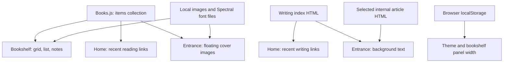
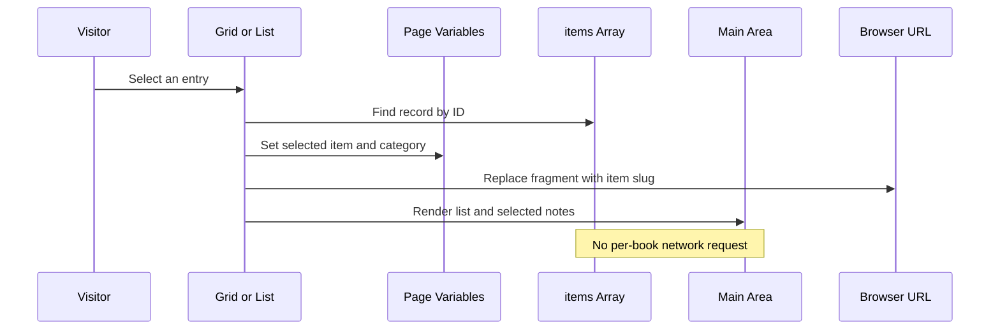

# Nitya’s Notes: website architecture and bookshelf implementation

**Reference:** [nityasnotes.com](https://nityasnotes.com/)  
**Inspected:** September 22, 2026  
**Purpose:** Explain the existing reference implementation, including its functions, UI structure, data shapes, rendering paths, and visual effects. This document does not implement it in Mariana’s website.

## 1. Scope and evidence

This analysis combines direct browser inspection with reading the public HTML, inline CSS/JavaScript, and the linked `Books.js` asset. Browser observations covered the bookshelf grid, the Books category, a selected book’s notes, the home page, and the animated entrance.

The implementation is a collection of HTML pages using vanilla JavaScript, custom CSS, and Tailwind’s browser CDN script. The inspected pages do not load a React/Next.js application bundle or a WebGL renderer. Their interactions are implemented directly against the DOM.

Important boundaries:

- **Confirmed:** publicly delivered markup, asset paths, function definitions, event handlers, data fields, and the interactions inspected in the browser.
- **Source-derived:** behavior evident in code but not individually exercised in the browser, including resizing, calendar behavior, and some responsive states.
- **Unknown:** original repository layout, build tooling, hosting configuration, CMS/editor, development history, and whether AI tools helped author the site. Static-looking output does not prove that no build system or backend exists upstream.
- **Excluded:** the internal implementation of the separate `/watches` project linked from Making Things. Article bodies and the RSS feed were not audited individually.

Primary sources used throughout this document:

| ID | Public source | What it establishes |
| --- | --- | --- |
| S1 | [Entrance](https://nityasnotes.com/) | Globe animation, tiled background, text extraction, entry transition |
| S2 | [Home](https://nityasnotes.com/home/) | Biography, recent writing and reading composition |
| S3 | [Bookshelf](https://nityasnotes.com/bookshelf/) | Grid, list, notes, calendar, theme, routing, and resizing |
| S4 | [Books.js](https://nityasnotes.com/Books.js?v=bookshelf-mind-at-play) | Shared content collection and presentation metadata |
| S5 | [Writing](https://nityasnotes.com/writing/) | Writing index and its machine-readable HTML structure |
| S6 | [Making Things](https://nityasnotes.com/making-things/) | Project index and shared navigation |

The site can change after this inspection. Function names and constants below describe the inspected snapshot. TypeScript interfaces and pseudocode in this document are explanatory models, not claims that the reference site is written in TypeScript.

## 2. System overview

The content collection is reused in three different presentations. Writing is maintained separately as HTML and then read by other pages.



There is no application database request in the inspected bookshelf flow. Its full collection is available after the browser loads `Books.js`. Filtering, selection, and reading notes are local operations. A fragment change such as `#a-mind-at-play` changes the displayed entry without fetching another book page. [S2–S5]

## 3. Public route and file tree

This is an **observed public URL/asset tree**, not the creator’s verified source repository. The HTML routes may correspond to files, generated pages, or hosting rewrites; their original filenames are unknown.

```text
nityasnotes.com/
├── /                                      HTML entrance + inline CSS/JS
├── /home/                                 HTML home + inline CSS/JS
├── /bookshelf/                            HTML bookshelf + inline CSS/JS
├── /writing/                              HTML writing index
│   ├── genius-needs-leisure-to-think-and-so-do-you   linked article
│   ├── why-are-attention-residuals-getting-so-much-attention
│   ├── phrases-i-carry-around
│   ├── packaging-of-discovery
│   ├── decades
│   └── running
├── /making-things/                        HTML project index
├── /watches                              linked project; not audited
├── /Books.js                             shared JavaScript content array
├── /images/                              referenced assets; partial inventory
│   ├── mind_at_play.jpg
│   ├── billion_dollar_molecule.jpg
│   ├── accelerando.jpg
│   ├── reader.jpg
│   └── v2lamp.png
├── /fonts/                               referenced local font files
│   ├── Spectral-ExtraLight.ttf
│   ├── Spectral-Light.ttf
│   ├── Spectral-Regular.ttf
│   └── Spectral-Medium.ttf
└── /feed.xml                             advertised RSS link; not audited

External runtime dependency:
└── https://cdn.tailwindcss.com            Tailwind browser script
```

Page-specific CSS and most behavior are inline in each delivered HTML document. There is no separate `BookCard.tsx`, `Bookshelf.tsx`, or router module in the inspected frontend. Those names would be abstractions we introduce in a React implementation. [S1–S6]

## 4. Visual system and hierarchy

### 4.1 Shared visual language

- **Typography:** locally hosted Spectral at weights 200, 300, 400, and 500; serif fallbacks.
- **Interior pages:** pale gray backgrounds, dark text, restrained gray navigation, thin separators, generous whitespace.
- **Accents:** orange identifies selected list entries and source links.
- **Entrance:** warm off-white background, faint tiled lines, low-contrast background text, translucent floating covers.
- **Dark mode:** a `dark` class on the document root, a `dark-mode` class on the body, and some inline colors. Templates also choose classes using the `darkMode` variable.

The effect comes from a small visual vocabulary used consistently, not from a large UI component library. Interior pages repeat a similar header, though their layout widths differ: the bookshelf uses the available width while several other pages use a capped container. [S1–S6]

### 4.2 Logical page components

These are conceptual components represented by HTML and functions in the original:

```text
Website
├── Entrance
│   ├── TileBackground
│   ├── WritingTextBackground
│   ├── PerspectiveScene
│   │   └── RotatingGlobe
│   │       └── ImageCard × N
│   └── CenteredEnterLink
└── InteriorPages
    ├── Header
    │   ├── SiteName → /home
    │   └── Navigation → bookshelf / making-things / writing
    ├── Home
    │   ├── Biography + current reading
    │   ├── RecentWriting
    │   ├── RecentReading
    │   └── Social/RSS links
    ├── Bookshelf
    │   ├── CategoryNavigation
    │   ├── MainArea
    │   │   ├── GridView, or
    │   │   └── ListView + NotesPanel
    │   └── Object overlays
    ├── WritingIndex
    │   ├── BlogsAndEssays
    │   └── Notes
    └── MakingThingsIndex
        └── WatchEngravingsProjectLink
```

### 4.3 Bookshelf DOM hierarchy

```text
body
├── header
├── responsive flex container
│   ├── aside
│   │   └── nav#categories
│   └── div#main-area
│       ├── when category = Bookshelf
│       │   └── main → responsive grid → rendered shelf objects
│       └── otherwise
│           ├── main.list-panel
│           │   ├── search input
│           │   └── div.list-item × filtered items
│           ├── div.split-resizer [role=separator]
│           └── aside → div#panel-content
├── div#modal                  generic overlay retained in markup
└── div#painting-modal         shared painting/calendar overlay
```

`renderMainArea()` chooses one of the two layouts and replaces the contents of `#main-area`. This is manual rendering with `innerHTML`, not component reconciliation. [S3]

## 5. Data shapes

### 5.1 Shared content records

`Books.js` declares one top-level `const items = [...]`. The inspected snapshot contains **40 records**. All have `id`, `title`, `author`, `category`, and `notes`; an author or notes value may be empty. Other fields are optional. [S4]

```ts
// Descriptive interface reconstructed from data and its consumers.
interface ShelfItem {
  id: number;
  title: string;
  author: string;
  category: Array<"Bookshelf" | "Books" | "Papers" | "Blogs" | "Movies" | "Videos">;
  notes: string;             // prose, blank lines, and sometimes HTML
  cover?: string;            // generally a local image path
  spineColor?: string;       // book side/fallback color
  type?: "blog" | "calendar" | "video" | "lamp" | "painting";
  url?: string;              // external reading/watching destination
  displayTitle?: string;     // alternate title for home-page links
  showInRecent?: boolean;    // false excludes it from recent reading
  slug?: string;             // supported by renderer; absent in snapshot
  dateRead?: string;         // supported by renderer; absent in snapshot
}
```

`category` and `type` serve different purposes. Categories determine collection membership and navigation. `type` selects special rendering/interaction behavior. A book normally has no `type`; membership in `Books` selects its 3D cover renderer.

For example, a record can belong to both `Books` and `Bookshelf`. It then appears in the book list and in the curated visual shelf. Items outside `Bookshelf` can still appear in category lists. Videos are explicitly excluded from the shelf grid even if they carry the shelf category.

There is no demonstrated Goodreads or book-cover lookup integration. Cover paths, notes, and titles are already present in the downloaded content asset. The original content-editing process is unknown.

### 5.2 Bookshelf state

```ts
interface BookshelfState {
  darkMode: boolean;
  selectedCategory: string;    // initially "Bookshelf"
  selectedItemId: number | null;
  searchQuery: string;
  listPanelWidth: number;      // JS fallback is 520px
  listResizeState: null | {
    handle: HTMLElement;
    pointerId: number;
    startX: number;
    startWidth: number;
  };
  calendarFlipConsumed: boolean;
}
```

These are separate script variables, not a single state object in the actual code. Rendering reads their current values. The interface groups them to show ownership. [S3]

| State | Storage/lifetime | Purpose |
| --- | --- | --- |
| Theme | `localStorage.darkMode` | Reused across interior pages |
| List width | `localStorage.bookshelfListPanelWidth` | Restores the preferred desktop split |
| Selected item | URL fragment; legacy `?item=` accepted | Shareable initial selection |
| Category, query | Page memory | Current view/filter; reset on category changes |
| Resize gesture | Page memory | Pointer capture and movement calculation |
| Calendar flip flag | Page memory | Allows the introduction animation once |

### 5.3 Other intermediate shapes

```ts
interface RecentWritingEntry {
  title: string;
  href: string;
  dateScore: number;      // home page: year * 12 + month index
  index: number;          // document order breaks date ties
  isExternal: boolean;
}

interface SpherePoint { x: number; y: number; z: number }

interface GlobeMotion {
  rotX: number; rotY: number;
  velX: number; velY: number;
  isDragging: boolean;
  lastX: number; lastY: number;
  autoRotate: boolean;
}
```

`getLiveCalendarDate()` returns a `Date` plus formatted day, month, year, English weekday, Tamil weekday/date, and Mandarin weekday fields. It uses the visitor’s local date and `Intl.DateTimeFormat`; it is not fetching a calendar service. [S1–S3]

## 6. The bookshelf’s visual shapes

### 6.1 A book is four planes

```text
.book-container                     perspective: 1000px
└── .book                           transform-style: preserve-3d
    ├── .book-back                  rear rectangle, negative Z depth
    ├── .book-spine                  narrow colored side, rotated -90°
    ├── .book-pages                  pale side, rotated +90°
    └── .book-cover                 front rectangle, positive Z depth
        ├── .book-fallback          title behind the image
        └── img                     cover image, object-fit: cover
```

The whole book rests at a Y rotation of −8 degrees. Hovering its container changes the rotation to −30 degrees over 0.4 seconds. Perspective, front/back separation, a colored spine, a page strip, rounded outer corners, and shadows create the apparent volume. No mesh, model file, canvas, or physics engine is involved. [S3]

| CSS dimension | Below 640px | At least 640px |
| --- | --- | --- |
| Cover width × height | 64 × 96px | 80 × 120px |
| Front/back depth variable | 6px | 8px |
| Spine width | 12px | 16px |
| Pages width | 10px | 14px |
| Fallback title size | 8px | 9px |

If an image fails, its inline error handler removes the image, exposing the title on the colored cover underneath.

### 6.2 Other shelf objects

| Object | Representation | Grid click action |
| --- | --- | --- |
| Book | CSS planes and cover image | Open its category and notes |
| Blog | White text card, orange dash, author | Open its category and notes |
| Ordinary paper/movie | Cover image and shadow | Open its category and notes |
| Lamp | Contained image with a theme-dependent glow | Toggle dark mode |
| Calendar | Nested HTML, CSS paper effects, formatted local date | Open enlarged calendar overlay |
| Painting | Cover image | Open enlarged image overlay |

`renderGridView()` branches on special `type` values before checking book category membership. The calendar includes layered paper, a previous-day element, and CSS flip animation. The larger overlay suppresses the introductory flip. [S3]

### 6.3 Responsive layout

- Grid classes request 4 columns by default, then 5, 7, 9, and 11 at Tailwind’s `sm`, `md`, `lg`, and `xl` breakpoints. Gaps use `gap-4`.
- Category navigation wraps above the content on small screens and becomes a left sidebar at `md`.
- At widths below 1280px, selecting an item hides the list and reveals its notes. Closing notes reveals the list again.
- At widths of at least 1280px, the list and notes coexist with a draggable separator. The list begins at the stored width or the 520px JavaScript default.
- The width clamp aims to reserve 360px for details while keeping the list at least 240px wide.

The observed intermediate-width browser view displayed notes in place of the list, consistent with those conditions. Not every breakpoint was visually tested. [S3]

## 7. Main bookshelf functions

### 7.1 Rendering and selection

| Function | Responsibility and effects |
| --- | --- |
| `renderCategories()` | Builds category buttons and marks the active category. |
| `selectCategory(category)` | Changes category; clears item, search, and item URL; renders navigation and main area. |
| `renderMainArea()` | Dispatches to grid for Bookshelf or list for other categories. |
| `renderGridView(container)` | Filters shelf membership, excludes videos, chooses object renderer, and inserts HTML. |
| `renderListView(container)` | Filters category and title/author query, puts items with notes first, and builds search/list/divider/details. |
| `renderPanelContent()` | Finds selected record, formats title/author/date/notes, and adds an optional Read it or Watch it link. |
| `handleSearch(event)` | Stores input value and rerenders the main area. |
| `selectItem(id)` | Selects a list entry, updates the URL, rerenders, and scrolls to the top below 1280px. |
| `goToItemNotes(id)` | Handles shelf-to-notes navigation: selects category and record, clears search, updates URL, and renders. |
| `closePanel()` | Clears selected record and URL, then rerenders the main area. |
| `getItemCategory(item)` | Finds the first supported non-Bookshelf category; falls back to Books. |
| `formatDate(d)` | Converts supported date strings to month/year; passes other strings through. |

Notes are not parsed by a Markdown library. The panel splits on blank lines, preserves chunks beginning with an HTML tag, and wraps other chunks as paragraphs. Existing records can contain HTML lists, links, blockquotes, and images. [S3–S4]

### 7.2 URL handling

| Function | Responsibility |
| --- | --- |
| `getItemSlug(item)` | Uses explicit slug, title, or ID; normalizes accents, punctuation, spaces, and case. |
| `findItemByUrlParam(param)` | Resolves either a numeric ID string or normalized slug. |
| `updateItemUrl(id)` | Removes the legacy item query and writes a fragment with `history.replaceState`. |
| `clearItemUrl()` | Removes the item query and fragment. |
| `applyInitialItemFromUrl()` | Reads fragment, or legacy query if absent, and initializes selection/category. |
| `scrollSelectedItemIntoView()` | Centers the selected desktop list item after initialization. |

Selection uses `replaceState`, not `pushState`, so each book click does not become a separate browser-history entry. Initialization reads the URL once; the inspected script does not register `hashchange` or `popstate` handlers. [S3]

### 7.3 Theme and panel resizing

| Function | Responsibility |
| --- | --- |
| `toggleDarkMode()` | Toggles and persists the theme, then applies it. |
| `applyDarkMode(on)` | Changes root/body classes and colors; rerenders navigation/content. |
| `clampListPanelWidth(width)` | Applies minimum list width and available-space constraints. |
| `setListPanelWidth(width, persist)` | Updates state and the CSS custom property; normally persists the width. |
| `startListPanelResize(event)` | Captures pointer, records initial position/width, and installs window listeners. |
| `resizeListPanel(event)` | Converts horizontal pointer delta into a new width. |
| `stopListPanelResize()` | Releases capture, clears state/styles, and removes listeners. |
| `handleListPanelResizeKey(event)` | Arrow keys adjust by 24px; Home/End choose the allowed extremes. |
| `resetListPanelWidth()` | Restores 520px on double-click. |

Window resizing recalculates the width without persisting that automatic adjustment. [S3]

### 7.4 Calendar and overlays

| Function | Responsibility |
| --- | --- |
| `getLiveCalendarDate(date)` | Produces local-date fields and multilingual weekday labels. |
| `renderMiniMonth(baseDate, offset)` | Generates a miniature month grid. |
| `shouldUseCalendarFlip()` | Consumes the once-per-page flip flag. |
| `renderCalendarObject(size, variant, options)` | Assembles the paper calendar HTML and optional flip layer. |
| `openModal(id)` | Dispatches special objects; also contains a generic item overlay path. |
| `openPaintingModal(item)` | Builds and displays the enlarged painting. |
| `openCalendarModal(item)` | Reuses the painting overlay container for a large calendar. |
| `closePaintingModal()` | Hides the shared painting/calendar overlay. |
| `closeModal()` | Hides the generic overlay. |
| `goToCategory(event)` | Closes generic overlay and switches category. |

Ordinary book clicks currently call `goToItemNotes`, not the generic item modal. The generic branches should not be mistaken for the primary reading experience. [S3]

## 8. Runtime call trees and event sequences

These are reconstructed call paths from source, not captured debugger stack traces. An asynchronous callback runs in a later task/frame after its initiating stack has returned.

### 8.1 Initial bookshelf load

```text
Parse HTML and load Books.js
  create state from defaults + localStorage
  set panel-width CSS variable
  register listeners
  applyInitialItemFromUrl()
    findItemByUrlParam()
      getItemSlug()
    getItemCategory()
    updateItemUrl()
  if saved dark mode
    applyDarkMode(true)
      renderCategories()
      renderMainArea()
  else
    renderCategories()
    renderMainArea()
      renderGridView() OR renderListView()
        renderPanelContent() when an item is selected
  scrollSelectedItemIntoView()
```

### 8.2 Clicking a book cover

```text
click handler
  goToItemNotes(id)
    items.find(id)
    getItemCategory(item)
    set selectedCategory + selectedItemId
    clear searchQuery
    updateItemUrl(id)
      getItemSlug(item)
      history.replaceState(...fragment)
    renderCategories()
    renderMainArea()
      renderListView()
        filter category/search
        sort entries with notes first
        setListPanelWidth(..., false)
        renderPanelContent()
        replace #main-area HTML
    scroll to top OR center selected desktop list item
```

### 8.3 Search and resize events

```text
search input keyup
  handleSearch(event)
    searchQuery = input value
    renderMainArea()
      renderListView()

separator pointerdown
  startListPanelResize(event)
    record initial width/position
    capture pointer + attach listeners

later pointermove
  resizeListPanel(event)
    setListPanelWidth(initial width + horizontal delta)
      clampListPanelWidth()
      update CSS variable + localStorage

later pointerup / pointercancel
  stopListPanelResize()
    release pointer + remove listeners
```

### 8.4 Selection data flow



## 9. Animated entrance

### 9.1 Scene layers and geometry

The entrance is a full-viewport composition with fixed body positioning and scrolling disabled. A tiled grid sits behind a masked text texture. A centered perspective scene contains the rotating images; the entry link sits above it. [S1]

```text
Visual depth/order
  z-index 10   centered site-name link and soft background halo
  z-index 2    #scene → #globe → image cards
  z-index 1    masked writing excerpts
  z-index 0    100px background tiles
```

The scene has a 1100px perspective. The globe is a zero-size origin with `preserve-3d`; absolutely positioned cards are translated around it. Back faces are hidden. Covers are reused from `Books.js`, with a hardcoded image-path fallback if that collection is unavailable.

There are 52 displayed cards on the larger layout and 28 below 700px. The source cycles available image paths to reach that count. Radius and card size are clamped functions of viewport width and height.

`buildSpherePoints(total)` uses a golden-angle distribution, then adjusts points around a central title band. Consequently, this is a visually tuned sphere-like arrangement rather than an exact uniform sphere after adjustment.

```text
For each image index:
  calculate a distributed point (x, y, z)
  adjust y to leave space around the title
  multiply coordinates by the chosen radius
  calculate yaw and pitch from the point
  create a cover image card
  assign translate3d + rotateY + rotateX
  append it to the globe
```

### 9.2 Motion functions and call path

| Function | Responsibility |
| --- | --- |
| `cycleImagePaths(paths, targetCount)` | Repeats image paths to fill the desired card count. |
| `buildSpherePoints(total)` | Calculates point positions with a title-band adjustment. |
| `getPointer(e)` | Extracts coordinates from mouse or touch events. |
| `onDown(e)` | Starts dragging, disables auto-rotation, resets velocity. |
| `onMove(e)` | Converts pointer delta into rotation and velocity. |
| `onUp()` | Ends dragging, leaving velocity for inertia. |
| `updateTransform()` | Writes the globe’s X/Y rotation to CSS. |
| `animate()` | Applies inertia and auto-rotation, then requests another frame. |

```text
script initialization
  choose images, radius, and card size
  buildSpherePoints()
  create/position cards
  register mouse/touch handlers
  updateTransform()
  animate()
    when not dragging:
      advance rotation by velocity
      clamp X rotation to -60°…60°
      multiply velocity by 0.95
      when both velocities are tiny:
        clear them and restore autoRotate
      if autoRotate: add 0.08° to Y rotation
      updateTransform()
    requestAnimationFrame(animate)
      → next frame, new callback stack
```

The pointer-to-angle multiplier is 0.3. This animation is frame-based rather than elapsed-time-based: its apparent speed can vary with refresh rate. Clicking the title adds a 0.6-second fade and navigates to `/home` after a timeout. A `pageshow` handler removes the fade class when returning via browser history. [S1]

### 9.3 Background writing extraction

The text texture is populated immediately with fallback lines. It then attempts to derive content from the writing index and selected internal articles.

| Function | Responsibility |
| --- | --- |
| `cleanWallText(text)` | Normalizes whitespace and strips Markdown-style link expressions. |
| `appendWallTextLine(text)` | Adds a text span using `textContent`. |
| `dedupeLines(lines)` | Removes short, empty, and duplicate lines. |
| `renderWallText(lines)` | Repeats lines until the viewport container overflows, capped at 420 attempts. |
| `parseWritingDate(text)` | Turns a month/year label into a timestamp for sorting. |
| `collectWritingPageLines(entry)` | Fetches an internal article and extracts selected text elements. |
| `loadRecentWritingWallTextLines()` | Fetches the writing index, sorts entries, and collects text from up to six recent entries. |
| `syncWallTextClearZone()` | Sets the elliptical mask dimensions around the title/globe. |
| `debounce(callback, wait)` | Limits resize-triggered updates; default delay is 120ms. |

```text
initial stack
  renderWallText(fallback lines)
  loadRecentWritingWallTextLines()
    fetch /writing/                         [async boundary]
    parse HTML and sort essay links
    for up to six recent entries:
      use title and subtitle
      if internal /writing/ link:
        collectWritingPageLines(entry)
          fetch article                    [async boundary]
          extract text from parsed HTML

promise completion
  cache resulting lines in page memory
  renderWallText(lines)
```

The mask and low opacity make the text decorative while keeping the center readable. External article bodies are not fetched by this routine. [S1]

## 10. Home, writing, and project pages

### 10.1 Home page

The biography and current-reading sentence are static markup. Two dynamic lists reuse other content sources. [S2]

**Recent reading:** filter the shared items to recognized reading/watching categories, exclude records with `showInRecent === false`, take the first six, and link them to bookshelf fragments. The ordering follows the array; it is not a sort by completion date. `displayTitle` overrides the ordinary title when present.

**Recent writing:** `renderRecentWriting()` fetches `/writing/`, parses it with `DOMParser`, and extracts `a.essay-item` elements. It reads a title from `h3`, a date from `p`, and the destination from `href`. `parseMonthYear()` creates the date score; entries are sorted and capped at seven. `makeWritingLink()` creates each link. On failure, the area falls back to a link to the writing index.

```text
home script
├── render recent reading synchronously from items
│   ├── filter → first six
│   ├── getItemSlug()
│   └── append links
└── renderRecentWriting()
    ├── fetch /writing/                     [async]
    ├── DOMParser → essay-item records
    ├── parseMonthYear() → sort → first seven
    └── makeWritingLink() → append links
```

This is HTML serving as an informal content API. Changing the writing index’s classes or internal element structure can affect both the home page and the entrance’s text extraction.

### 10.2 Writing index

The writing page groups external blogs/essays and internal notes into two columns at wider sizes. Entries are ordinary anchors with date/title/description markup. The `essay-item` class is both a styling hook and an extraction contract consumed elsewhere. It advertises an RSS feed, but the reviewed frontend does not explain how the feed or article pages are generated. [S5]

### 10.3 Making Things

The inspected project index is primarily static markup and contains a project link to `/watches`. It restores the same stored dark-mode preference and uses the same font/header vocabulary. The watch-search project’s implementation is outside this audit. [S6]

## 11. Network and persistence boundaries

| Resource or operation | Consumer | Purpose |
| --- | --- | --- |
| HTML page routes | Browser navigation | Load individual site sections |
| Tailwind CDN script | Inspected pages | Utility-style runtime |
| `/Books.js?...` | Entrance, home, bookshelf | Load shared content; query strings version the URL |
| `/images/...` | Covers and decorative objects | Static visual assets |
| `/fonts/...` | Page styling | Local font files |
| `fetch('/writing/')` | Entrance and home | Extract writing metadata from HTML |
| Internal article fetches | Entrance | Extract background excerpts |
| URL fragments | Bookshelf | Initialize/share an item selection |
| `localStorage` | Theme and split layout | Persist browser-local preferences |
| External item URLs | Visitor navigation | Read or watch source material |

No authenticated API, content write endpoint, or server-side session is demonstrated in these inspected flows. This is a statement about observed behavior, not a full server or infrastructure audit.

## 12. Implementation strengths and limitations

### 12.1 Strengths worth retaining

- One curated collection powers several experiences without a synchronization service.
- CSS geometry creates the book effect with normal DOM elements and images.
- Static content and local filtering suit a modest personal collection.
- URL fragments make book notes directly shareable.
- The desktop divider has keyboard support as well as pointer controls.
- Several fallback paths exist: broken covers expose title text, writing failures preserve navigation/fallback text, and the entrance has a no-JavaScript link to the home page.

### 12.2 Source-level limitations

These observations distinguish code evidence from issues that would need additional runtime reproduction.

| Finding | Evidence and consequence |
| --- | --- |
| Search recreates its own input | `handleSearch()` rerenders all of `#main-area` on keyup. The focused input is replaced without focus/selection restoration, creating a likely typing interruption. |
| Clickable shelf/list entries are mostly divs | Most do not have button semantics or keyboard handlers. The category buttons and divider are better supported than the core item-selection controls. |
| Notes are inserted as HTML | Suitable only for trusted, curated content as written. There is no observed sanitization boundary for importing arbitrary HTML. Search text is also interpolated into generated markup. |
| URL state is initialized but not fully synchronized | There are no registered fragment/history listeners in the inspected bookshelf script. Navigation that changes only a fragment may not refresh selection. |
| Generic modal path contains stale-looking assumptions | `openModal()` accesses `modal-category-link`, but that ID is absent from the inspected markup. Ordinary book clicks bypass this path, so it should not be described as a currently observed book-click failure. |
| Mini-calendar always allocates 35 cells | Some months require six weeks; late dates can be omitted by that fixed-size grid. |
| Calendar refresh is render-triggered | Dates are computed during rendering, with no midnight timer visible. An untouched tab can keep yesterday’s date until it rerenders/reloads. |
| Entrance animation is continuous and frame-based | The script schedules frames indefinitely and uses fixed per-frame rotation/decay. No reduced-motion branch was found in that script. |
| Geometry is calculated primarily at entrance startup | The resize callback updates the text layout, not the initial globe radius/card positions. |
| Shared presentation is repeated across pages | Header, font, theme, and slug logic can drift because the delivered pages duplicate them. The upstream authoring process could still use templates; it was not available for inspection. |
| Writing extraction depends on presentation markup | Home and entrance rely on index classes/tags rather than a dedicated structured content file. |

These are design and maintenance tradeoffs, not evidence that a heavier application framework or backend is required. [S1–S6]

## 13. Mapping the ideas onto Mariana’s existing site

This section is a **proposed adaptation**, not the reference creator’s actual file tree and not code created by this task. It retains the current Next.js project and static-export approach.

```text
personal_website/
├── app/
│   └── bookshelf/
│       ├── page.tsx                    route and static page shell
│       ├── bookshelf.tsx               category, selection, search state
│       ├── bookshelf.module.css        grid, depth, hover, responsive rules
│       ├── book-card.tsx               reusable cover/spine/pages markup
│       └── book-notes.tsx              selected-entry presentation
├── lib/
│   └── bookshelf.ts                    typed collection and slug helpers
├── content/
│   └── books/                          optional longer notes, authored in Markdown
└── public/
    └── images/
        └── books/                      locally stored cover assets
```

Start with one collection and a grid of accessible book buttons. Add a notes view only if there are notes to show. Keep selection in a fragment or another deliberately chosen URL representation. A database, authentication system, or external book API is not necessary for that scope.

If the animated entrance is desired later, implement it as an independent feature. It reuses the collection’s imagery but is not required for the bookshelf. Likewise, a resize handle, custom calendar, or lamp theme switch can be added independently.

Use React state/components instead of replacing large HTML strings. Keep long-form notes separate from visual metadata if the collection grows, and choose a safe rendering path for any imported content. Preserve the reference’s strongest idea: **one content collection, several small views, and visual richness supplied by CSS.**

## 14. Verification record

- Read the public HTML of the entrance, home, bookshelf, writing index, and Making Things index.
- Read the linked `Books.js` asset; inspected its object fields with a syntax parser without executing downloaded JavaScript locally.
- Observed bookshelf grid → Books list → selected notes in a browser; selection produced the expected title fragment.
- Observed the home and animated entrance visually.
- Reconstructed function call paths and responsive behavior from the public source.
- Did not verify the original repository, hosting provider, authoring workflow, every browser/device, all overlay paths, or the linked watch project.

This document is a reference-site study. It does not assert that its proposed React component names or file structure already exist in either website.
